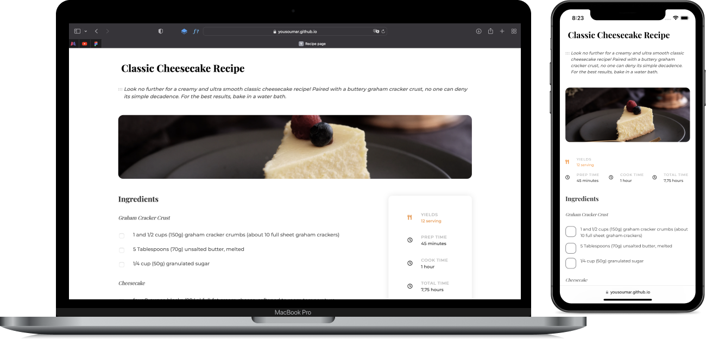

Intégration d'une page `responsive` présentant une recette de cuisine en `HTML` et `CSS`.

C'est un <a href="https://devchallenges.io/challenges/OEKdUZ6xs0h99C38XVht">`challenge`</a> de `devchallenge.io`.

Visiter en cliquant sur l'image ci-dessous ou sur le lien en bas de la section `About`.

`Note : il s'agit là d'une vieille réalisation de mes débuts mise récemment sur Github.`

<a href = "https://yousoumar.github.io/recipe-page/"></img></a>